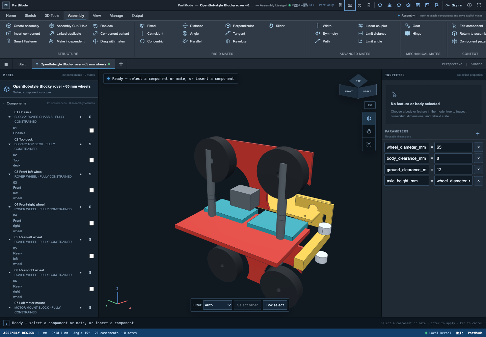
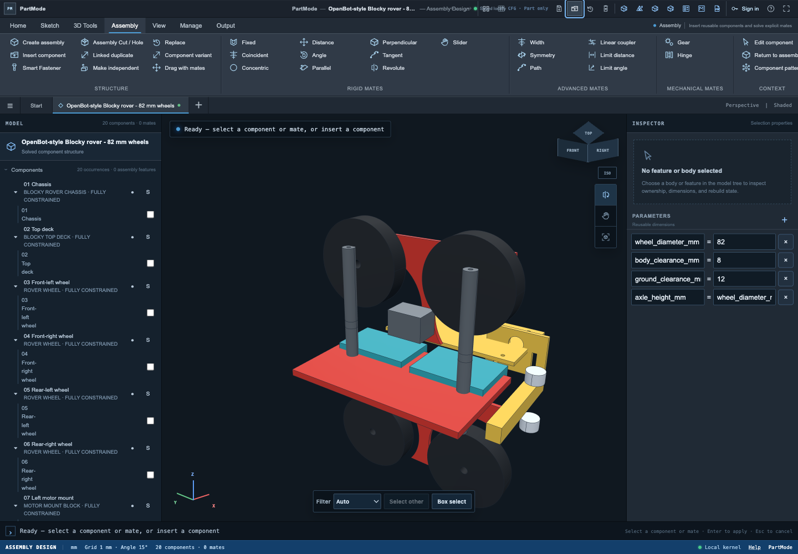

# OpenBot-style Blocky rover

This is a small, editable PartMode rover for the agent and dependency-graph demo. It is newly authored proxy geometry inspired by OpenBot's Blocky body, not a conversion of the official CAD and not a production vehicle definition.

## Start here

Open either project directly in PartMode:

- `openbot-blocky-rover-65mm.bomcad.json`: baseline with 65 mm wheels.
- `openbot-blocky-rover-82mm.bomcad.json`: deterministically propagated result with 82 mm wheels.

The assembly contains a chassis, top deck, four wheel occurrences, two motor mounts, two wheel guards, battery and electronics trays, four standoffs, a phone/camera plate, an eye bumper, and two sensor eyes. A saved exploded view is active by default.

| Baseline | Propagated result |
|---|---|
|  |  |

Regenerate all assets:

```bash
node examples/openbot-rover/build-assets.mjs
```

## Nemotron prompt

Give the PartMode agent this bounded request:

> Upgrade the rover from 65 mm to 82 mm wheels. Preserve 8 mm wheel-to-body clearance, 12 mm chassis ground clearance, and left/right symmetry. Update only the shared wheel parameter and the transforms listed by the rover agent contract. Show the proposed operations before applying them.

The expected seven-operation patch is frozen in `requests/upgrade-wheels-82mm.expected.json`: one `parameter.update`, four wheel `component.update` operations, and two motor-mount `component.update` operations. Wheel-well cutouts rebuild from the shared parameter.

Do not count a conversational answer as success. Compare the result with the checked-in 82 mm project and verify:

- all four wheel bottoms remain at `Z=0`;
- both motor mounts follow the new axle height;
- wheel-well radial clearance remains 8 mm;
- left/right transforms remain symmetric.

## MongoDB graph

```bash
mongoimport --db hackathon --collection rover_nodes \
  --file examples/openbot-rover/mongo/nodes.ndjson

mongoimport --db hackathon --collection rover_edges \
  --file examples/openbot-rover/mongo/edges.ndjson
```

The JSONL separates CAD-authored structure from `team-authored` propagation rules. MongoDB can retrieve the impact set; deterministic code owns transforms and validation.

## Agent parts catalog

`agent-parts-catalog.json` exposes four bounded reusable primitives already present in the project:

- perforated beam;
- right-angle bracket;
- axle spacer;
- sensor eye pod.

Allow no more than two insertions per request and require collision checks plus human approval. Do not add gears, suspension, arbitrary studs, wiring, or free-form generated meshes before the wheel upgrade works end to end.

## Provenance

OpenBot's [Blocky CAD directory](https://github.com/ob-f/OpenBot/tree/master/body/diy/cad/block_body) is an MIT-licensed visual and BOM reference. Its `block_body_bottom.step` was rejected by the tested PartMode importer as an invalid/open solid, so none of that geometry is embedded here. The model is a team-authored proxy using PartMode schema 5. PartMode itself is AGPL-3.0-only.
