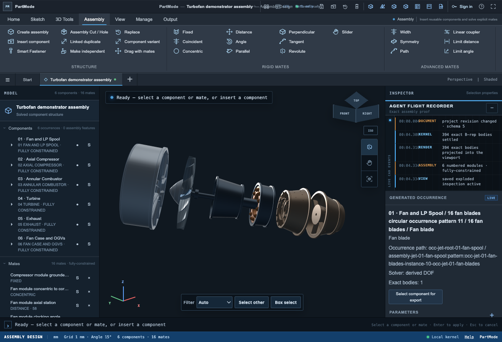

# Turbofan graph starter

This directory is a self-contained, deterministic input for the dependency-graph demo. It is the native PartMode conceptual turbofan, not a recovered production engine and not an aerodynamic or manufacturing definition.



## What is here

- `partmode-turbofan.bomcad.json`: complete editable PartMode schema-5 project.
- `turbofan-bom.json`: compact occurrence-level BOM with pattern quantities.
- `turbofan-graph.json`: backend-neutral nodes and edges.
- `mongo/nodes.ndjson` and `mongo/edges.ndjson`: direct `mongoimport` inputs.
- `demo-dependencies.json`: a small, explicitly hypothetical change-impact layer for the agent demo.
- `source/studio-jet-engine.js`: pinned generator source copied from PartMode.
- `turbofan-exploded.png`: verified local render of the packaged model.

Regenerate every JSON asset with Node.js 18 or newer:

```bash
node examples/turbofan/build-assets.mjs
```

## MongoDB import

The interchange format does not depend on MongoDB. To load the two collections locally:

```bash
mongoimport --db hackathon --collection turbofan_nodes \
  --file examples/turbofan/mongo/nodes.ndjson

mongoimport --db hackathon --collection turbofan_edges \
  --file examples/turbofan/mongo/edges.ndjson
```

Index the IDs and traversals used by the demo:

```javascript
use hackathon
db.turbofan_nodes.createIndex({ nodeId: 1 }, { unique: true })
db.turbofan_edges.createIndex({ fromNodeId: 1, type: 1 })
db.turbofan_edges.createIndex({ toNodeId: 1, type: 1 })
```

## First demo request

Start with one controlled change:

> Increase the compressor-case radial envelope by 4 mm while preserving 1 mm blade-tip clearance.

The agent should only translate that request into a structured proposal. Retrieval follows `demo-dependencies.json` to surface the compressor rotor blades, stator vanes, and adjacent combustor interface. Deterministic CAD regeneration and clearance checks must accept the proposal before write-back.

The native model currently has no public reusable parameter for this change. For the first demo, show the retrieved impact set and proposed patch; do not claim the geometry has propagated until an explicit parameterization and validation step exists.

## Relationship tiers

- `authored`: definitions, occurrences, transforms, mates, and occurrence patterns present in the PartMode project.
- `geometry`: exact part features and bodies present in the project.
- `assumption`: conceptual material assignments from the source model.
- `team-authored-demo-hypothesis`: proposed causal relationships in `demo-dependencies.json`; these are not recovered engineering intent.

## Provenance and license

The generator and derived project come from [BOMWiki/partmode](https://github.com/BOMWiki/partmode) at commit [`fe88558a34c8d7a3e03b34c2a374ba5ce6febe9f`](https://github.com/BOMWiki/partmode/commit/fe88558a34c8d7a3e03b34c2a374ba5ce6febe9f) and are provided under AGPL-3.0. See `LICENSE-AGPL-3.0.txt`. Preserve the license and source offer when modifying or serving the PartMode-derived application.
